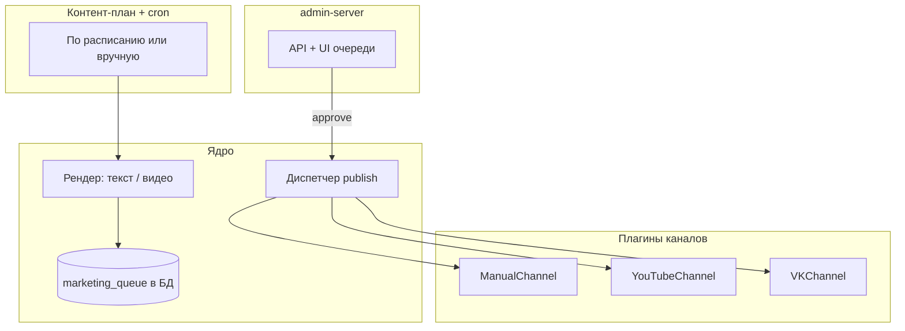

# Маркетинг-автоматизация Serpmonn — план

> **Статус:** зафиксировано 2026-08-22, реализация не начата.  
> **Суть:** внутренний конвейер рекламы от имени компании — контент → очередь в админке → approve → публикация в подключённые каналы.  
> **Принцип:** новый канал = новый плагин; ядро и админка не переписываются.

---

## Цели

- Готовить рекламный контент (текст, позже видео Shorts) **от имени Serpmonn**.
- Публиковать **только после approve** в существующей **admin-панели** (`admin-server`).
- Каналы подключаются по одному; включил канал в настройках — он появляется при публикации.
- Каналы равноправны: **YouTube, VK, LinkedIn, Manual (DTF и т.п.)** — YouTube один из них, не «главный».
- **Telegram** не используем как рекламный канал и не как UI approve.
- UTM на все ссылки; связь с Метрикой (`partner_topup`, `payment_success` и т.д.) — в отчётах.

## Чего не делаем

- **Telegram** — ни как рекламный канал, ни как интерфейс approve.
- Автопост «куда угодно» без превью в админке.
- Публичная часть на сайте — только внутренний инструмент для команды.
- Отдельный **dry-run** / dev-стенд для маркетинга — **сразу prod**; черновики не уходят наружу, пока не нажата «Опубликовать».

---

## Как это выглядит в админке

Новый раздел рядом с модерацией партнёрок:

```
Админка Serpmonn
├── … (система, партнёры — уже есть)
└── Маркетинг
    ├── Очередь          ← главный экран
    ├── Каналы           ← подключение / статус
    ├── Отчёты           ← публикации, UTM (nginx), topups/партнёры
    └── Контент-план     ← продукты и расписание (фаза 3 / cron)
```

### Очередь

Таблица карточек (аналог модерации офферов):

| Превью | Продукт | Тип | Каналы | Статус | Действия |
|--------|---------|-----|--------|--------|----------|
| ▶ | Neli | Short | YouTube, VK | На проверке | Открыть · Опубликовать · Отклонить |
| текст | Partners EN | Post | Manual | Черновик | … |

**Карточка публикации:** превью (видео или текст), заголовок, описание, CTA URL с UTM, время публикации, чекбоксы каналов, кнопки «Опубликовать» / «Сохранить» / «Отклонить». После публикации — статус и **ссылка на пост** по каждому каналу.

### Каналы

| Канал | MVP | Позже |
|-------|-----|-------|
| **Manual** | текст + инструкция (DTF и т.п., без API) | — |
| **YouTube Shorts** | stub в реестре | OAuth + upload API |
| **VK** | stub в реестре | wall.post |
| **LinkedIn** | stub в реестре | EN для партнёрки |
| **DTF** | через Manual | опционально Playwright |

Подключение канала: форма credentials / OAuth → «Проверить» → канал доступен в чекбоксах.  
YouTube **не** приоритетнее остальных — порядок публикации = выбранные в карточке галочки.

---

## Архитектура (плагины каналов)



**Контракт каждого канала** (`backend/marketing/channels/*.mjs`):

- `id`, `label`, `supports(item)` — подходит ли формат (video / text)
- `isConfigured()` — есть ли токены
- `publish(item)` → `{ ok, url?, error? }`
- `healthCheck()` — проверка credentials

Добавление TikTok / LinkedIn = новый файл + регистрация в реестре каналов.

---

## Жизненный цикл публикации

```
draft → rendering (если видео) → pending_review → publishing → published
                                                      ↘ failed (по каналу)
```

1. Cron или кнопка «Создать из шаблона» → черновик в очереди.
2. При необходимости — рендер mp4 (FFmpeg: intro Serpmonn + клип + outro + субтитры).
3. Статус `pending_review` — видно в админке.
4. Approve → диспетчер вызывает каждый **включённый** канал.
5. В карточке — результат по каналам (ссылки, ошибки).

---

## Где живёт код

```
/var/www/serpmonn.ru/
├── backend/marketing/
│   ├── channels/           # manual.mjs, youtube.mjs, vk.mjs, …
│   ├── templates/          # neli-short.json, partners-en.json
│   ├── brand/              # logo, intro.mp4, fonts, music (royalty-free)
│   ├── assets/clips/       # исходники геймплея
│   ├── out/                # готовые mp4 (gitignore)
│   ├── queue.mjs           # CRUD очереди
│   ├── dispatcher.mjs      # publish по каналам
│   ├── generate-copy.mjs   # тексты через Ollama
│   ├── reports.mjs         # отчёты (публикации / UTM / topups)
│   ├── render-short.mjs    # фаза 2
│   └── cron.mjs            # контент-план по расписанию
├── backend/admin/
│   ├── marketingAdmin.mjs  # handlers
│   └── adminRoutes.mjs     # + /marketing/*
└── docs/marketing-automation-plan.md   # этот файл
```

Секреты: `backend/.env` (`YOUTUBE_*`, `VK_*`, …).  
Cron на prod (пример):

```bash
0 10 * * 2 cd /var/www/serpmonn.ru && node backend/marketing/cron.mjs >> /var/log/serpmonn-marketing.log 2>&1
```

Маркетинг **не** в `frontend/` для пользователей; `deploy:prod` assembly фронт не затирает `backend/marketing/`.

---

## Видеогенерация (фаза 2)

Не «ИИ с нуля», а **шаблонная фабрика Shorts**:

1. Клип геймплея (Neli / app) — заранее или запись экрана.
2. FFmpeg: intro (лого 2 сек) + клип + outro (CTA + URL).
3. Субтитры из `content.json`; опционально TTS (один голос бренда).
4. Обложка из шаблона (sharp/canvas).
5. Выход: 1080×1920, 15–45 сек → preview в админке → YouTube `videos.insert` + `publishAt`.

Бренд-пакет один раз: лого, цвета, голос, подпись описания «Serpmonn — …», UTM, хештеги.

---

## Продукты и шаблоны (контент-план)

| Продукт | Формат | Каналы (целевые) | Расписание (черновик) |
|---------|--------|------------------|------------------------|
| Neli | Short | YouTube, VK | 1× в неделю |
| Partners EN | Post / Short | YouTube, LinkedIn | 1× в 2 недели |
| App | Short | YouTube, VK | по необходимости |

UTM пример: `?utm_source=youtube&utm_medium=shorts&utm_campaign=neli_w34`

---

## Связь с уже сделанным

- **Метрика `partner_topup`** — цель при успешном topup рекламодателя (`frontend/partners/advertiser.js`, счётчик `98158791`).
- **Директ** — отдельный paid-канал; отчёты маркетинг-модуля могут подтягивать nginx + БД + (позже) Метрика API.
- **Admin API** — тот же `admin-server`, `verifyAdmin`, паттерн как `/partners/moderation`.

---

## Фазы реализации

### Фаза 1 — скелет (MVP)

- [x] Таблица `marketing_queue` (+ `marketing_channel_log`)
- [x] API: `GET/POST /api/admin/marketing/queue`, reject, publish
- [x] UI в админке: очередь + карточка (`/frontend/admin/marketing.html`)
- [x] Канал **Manual** (показ текста и CTA для ручной публикации)
- [x] Ручное «Создать из шаблона» (Neli / Partners EN)
- [x] Экран **Каналы** — registry + health (Manual готов; YouTube/VK stub)

### Фаза 2 — видео + автоканалы (равноправно)

- [x] `render-short.mjs` + бренд-пакет (`brand/`, `assets/clips/neli-promo.png`)
- [x] VK подключён (`MARKETING_VK_*`, community group #229370902) — `wall.post` + video/photo
- [x] YouTube publish готов (нужны `MARKETING_YOUTUBE_*` + `youtube-oauth-setup.mjs`)
- [x] Превью медиа в карточке + «Перерендерить видео»
- [x] Шаблон `neli-short` [video] — авторендер при создании

### Фаза 3 — расширение

- [x] Генерация текстов через Ollama (`generate-copy.mjs`, кнопка «Новый текст», авто при создании)
- [ ] LinkedIn (EN, партнёрка)
- [ ] Cron по контент-плану
- [x] Отчёты в админке (публикации + UTM из nginx + partner topups/users) — без Метрики/YouTube пока
- [ ] Метрика API + просмотры YouTube в отчётах
- [ ] Новые каналы только плагинами
- [ ] Геймплей-клипы вместо статичного promo-кадра

---

## Пример сценария (вторник, Neli)

1. Cron в 10:00 создаёт «Neli Short #N» → рендер mp4.
2. В админке статус «На проверке», превью 20 сек.
3. Правка заголовка → ☑ YouTube ☑ VK → «Опубликовать в 18:00».
4. В 18:00 upload; в карточке ссылки на ролики.
5. Через неделю в «Отчётах» — переходы по UTM с этого ролика.

---

## Когда вернёшься к задаче

1. Прочитать этот файл.
2. Старт с **фазы 1** — БД + API + экран очереди + Manual.
3. Не подключать TG; YouTube — только после работающей очереди и approve.
4. Первый живой автоканал — **YouTube** (фаза 2), не dry-run.

---

## Открытые вопросы (решить перед фазой 2)

- Один YouTube-канал «Serpmonn» или отдельные (Games / Partners)?
- TTS или только субтитры в Shorts?
- Кто имеет доступ к разделу «Маркетинг» в admin (все admin или отдельная роль)?
