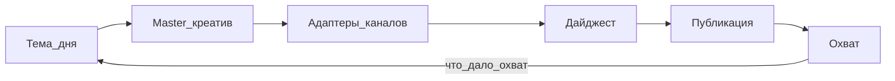

# Маркетинг-автоматизация Serpmonn

> **Цель:** максимальный **бесплатный охват**.  
> **Продукт:** Промокоды (бренд-онли Serpmonn).  
> **Режим:** утро собирает дайджест → **Публикации** → «Опубликовать всё».  
> **Контент-правило:** только бренд Serpmonn; обычный текст по-русски (латиница — только бренды/термины).

---

## Поток



1. Master-текст (GigaChat → Ollama → шаблон) + картинка.  
2. Рандомные хештеги из пула + нативные версии по включённым площадкам.  
3. Человек утверждает пачку.  
4. Публикация: VK auto, Telegram auto, Дзен/прочие — чеклист.  
5. Отчёты: **Σ reach**, reach/пост, по каналам и времени.

---

## Площадки

Вкл/выкл во вкладке **Площадки**: VK, Telegram, Дзен, YouTube, OK, Rutube, прочие (manual).

---

## Генерация текста

- Обычный текст — **только русский**.  
- Латиница допустима для брендов и терминов (Serpmonn и т.п.).  
- Хештеги рандомизируются (3–5 из пула, всегда с `#Serpmonn`).

---

## Код

```
backend/marketing/
├── platforms.mjs
├── channel-adapt.mjs
├── reach.mjs
├── content-adapters.mjs
├── generate-copy.mjs / generate-assets.mjs
├── digest.mjs / cron.mjs / dispatcher.mjs
└── channels/  (vk, telegram, dzen, youtube, manual)
```

Секреты: `GIGACHAT_CREDENTIALS`, `MARKETING_VK_*`, `MARKETING_TG_*`.
